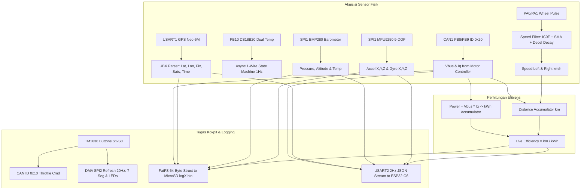

# 📁 STM32F446RE Telemetry Hub, Cockpit Controller & Data Logger

*Firmware* inti akuisisi data kendaraan, antarmuka kokpit pengemudi, fusi sensor, dan perekam data berkecepatan tinggi yang berjalan pada mikrokontroler **STM32F446RE** (Arm® Cortex®-M4 berkecepatan 180 MHz, 512 KB Flash, 128 KB SRAM, dengan antarmuka perangkat keras SDIO, SPI ganda, CAN Bus, dan UART multi-kanal).

Modul ini bertindak sebagai **otak sentral kokpit mobil Kukang EV**: membaca seluruh sensor fisik kendaraan, mengatur perintah akselerasi motor penggerak ke STM32G4 melalui CAN Bus, mengelola tampilan layar dashboard TM1638 pengemudi, menyimpan log biner beresolusi tinggi ke MicroSD, serta memasok paket data telemetri JSON secara kontinu ke ESP32-C6 IoT Co-MCU.

---

## 📌 Alokasi Pin & Periferal (Pinout)

Berikut adalah daftar alokasi pin mikrokontroler STM32F446RE yang dikonfigurasi dalam `main.c` dan `stm32f4xx_hal_msp.c`:

| Pin MCU | Fungsi Periferal | Mode / Tipe | Deskripsi & Koneksi Perangkat |
| :--- | :--- | :--- | :--- |
| **PA0** | `TIM2_CH1` | AF Input (AF1) | Sensor Pulsa Kecepatan Roda Kanan (*Right Wheel Speed*) |
| **PA1** | `TIM5_CH2` | AF Input (AF2) | Sensor Pulsa Kecepatan Roda Kiri (*Left Wheel Speed*) |
| **PA2** | `USART2_TX` | AF Push-Pull (AF7) | Serial TX ke ESP32-C6 Co-MCU (115200 bps, paket JSON) |
| **PA3** | `USART2_RX` | AF Push-Pull (AF7) | Serial RX dari ESP32-C6 Co-MCU (115200 bps) |
| **PA5** | `SPI1_SCK` | AF Push-Pull (AF5) | SPI1 Serial Clock (Jalur Sensor IMU & Barometer) |
| **PA6** | `SPI1_MISO` | AF Push-Pull (AF5) | SPI1 Master In Slave Out |
| **PA7** | `SPI1_MOSI` | AF Push-Pull (AF5) | SPI1 Master Out Slave In |
| **PC4** | `GPIO_Output` | Output Push-Pull | `SPI1_CS_BARO` (Chip Select Barometer BMP280, Active Low) |
| **PC5** | `GPIO_Output` | Output Push-Pull | `SPI1_CS_IMU` (Chip Select IMU 9-DOF MPU9250, Active Low) |
| **PB10** | `GPIO_Output` | Output Open-Drain (Pull-up)| Bus 1-Wire Digital Suhu Dual Sensor DS18B20 (Timing via TIM14) |
| **PB12** | `GPIO_Output` | Output Push-Pull | `SPI2_CS` (Strobe / Chip Select modul TM1638) |
| **PB13** | `SPI2_SCK` | AF Push-Pull (AF5) | SPI2 Serial Clock ke Modul Display TM1638 (DMA Stream 4) |
| **PB15** | `SPI2_MOSI` | AF Push-Pull (AF5) | SPI2 Master Out (DIO) ke Modul Display TM1638 (DMA Stream 4) |
| **PB8** | `CAN1_RX` | AF Push-Pull (AF9, Pull-up)| Jalur Penerimaan CAN Bus (dari Motor Controller STM32G4) |
| **PB9** | `CAN1_TX` | AF Push-Pull (AF9) | Jalur Pengiriman CAN Bus (ke Motor Controller STM32G4) |
| **PA8** | `GPIO_Input` | Input Pull-up | `SDIO_DET` (Pin Deteksi Fisik Keberadaan MicroSD) |
| **PC8** | `SDIO_D0` | AF Push-Pull (AF12, Pull-up)| SDIO Data Bit 0 (MicroSD High-Speed 4-Bit Bus) |
| **PC9** | `SDIO_D1` | AF Push-Pull (AF12, Pull-up)| SDIO Data Bit 1 (MicroSD High-Speed 4-Bit Bus) |
| **PC10** | `SDIO_D2` | AF Push-Pull (AF12, Pull-up)| SDIO Data Bit 2 (MicroSD High-Speed 4-Bit Bus) |
| **PC11** | `SDIO_D3` | AF Push-Pull (AF12, Pull-up)| SDIO Data Bit 3 (MicroSD High-Speed 4-Bit Bus) |
| **PC12** | `SDIO_CK` | AF Push-Pull (AF12, Pull-up)| SDIO Clock Bus ke Kartu MicroSD |
| **PD2** | `SDIO_CMD` | AF Push-Pull (AF12, Pull-up)| SDIO Command / Response Line |
| **PA9** | `USART1_TX` | AF Push-Pull (AF7) | Serial TX ke Modul GPS Neo-6M / 7M (115200 bps) |
| **PA10** | `USART1_RX` | AF Push-Pull (AF7) | Serial RX dari Modul GPS Neo-6M / 7M (Protokol UBX/NMEA) |
| **PB2** | `GPIO_Output` | Output Push-Pull | `USER_LED` Onboard (Toggle setiap menerima CAN ID 0x20) |
| **PC13** | `GPIO_Input` | Input Pull-down | `USER_BTN` Onboard Pushbutton |
| **PA11** | `USB_DM` | USB Peripheral | USB CDC Virtual COM Port (CLI Serial Debug & SD File Manager) |
| **PA12** | `USB_DP` | USB Peripheral | USB CDC Virtual COM Port (CLI Serial Debug & SD File Manager) |
| **PC6** | `USART6_TX` | AF Push-Pull (AF8) | Serial Ekspansi USART6 TX |
| **PC7** | `USART6_RX` | AF Push-Pull (AF8) | Serial Ekspansi USART6 RX |

---

## 🎛️ Antarmuka Kokpit Pengemudi (Modul TM1638)

Papan STM32F446RE terhubung ke modul **TM1638** yang ditempatkan tepat di depan roda kemudi pengemudi. Modul ini menyediakan **8 Tombol Tekan (S1–S8)**, **8 Lampu LED Indikator**, dan **Display 8-Digit 7-Segmen**. Pembaruan tampilan dieksekusi secara non-blocking menggunakan SPI2 via DMA (DMA1 Stream 4 Channel 0) setiap 50 ms (laju 20 Hz).

```text
+-----------------------------------------------------------------------+
|  [LED1]  [LED2]  [LED3]  [LED4]  [LED5]  [LED6]  [LED7]  [LED8]       |
|  +----+  +----+  +----+  +----+  +----+  +----+  +----+  +----+       |
|  | S  |  | E  |  | T  |  |    |  | 1  |  | 2  |  | 0  |  | 0  | (7-Seg)|
|  +----+  +----+  +----+  +----+  +----+  +----+  +----+  +----+       |
|   (S1)    (S2)    (S3)    (S4)    (S5)    (S6)    (S7)    (S8)        |
|  THROTTLE DOWN    UP    MOTOR/EFF  LOG     GPS    TEMP     IMU        |
+-----------------------------------------------------------------------+
```

### 1. Fungsi 8 Tombol Tekan (Buttons S1 – S8)

Semua tombol dilengkapi algoritma debouncing berbasis sampling ganda 50 ms dan deteksi tepi (*edge detection*):

| Tombol | Mask Bit | Fungsi Kontrol | Perilaku Operasional & Logika |
| :---: | :---: | :--- | :--- |
| **S1** | `0x01` | **Throttle / Gas (Momentary)** | Selama ditekan, sistem mengirim perintah CAN ID `0x10` (`run_state=1`, `motor_target_rpm`) secara berulang ke STM32G4. Saat dilepas (*falling edge*), sistem otomatis mengirim 3 paket stop berturut-turut (`run_state=0`) dan mengembalikan layar ke mode Set RPM. |
| **S2** | `0x02` | **Speed Down (Turun RPM)** | Mengurangi target kecepatan motor sebesar **100 RPM** (Batas bawah minimum: 100 RPM). Dilengkapi fitur *auto-repeat* cepat jika tombol ditahan lebih dari 400 ms. |
| **S3** | `0x04` | **Speed Up (Naik RPM)** | Menambah target kecepatan motor sebesar **100 RPM** (Batas atas maksimum: 5000 RPM). Dilengkapi fitur *auto-repeat* cepat jika tombol ditahan lebih dari 400 ms. |
| **S4** | `0x08` | **Mode Motor & Efisiensi** | Mengubah tampilan layar 7-segmen ke menu kelistrikan dan efisiensi. Setiap penekanan menggilir 6 sub-mode: Tegangan Bus, Arus Torsi, Daya Watt, RPM Roda Kanan, RPM Roda Kiri, dan Efisiensi km/kWh. |
| **S5** | `0x10` | **Start / Stop Datalogger** | Mengontrol perekaman file biner ke MicroSD (`logX.bin`). Dilengkapi lockout debounce 400 ms. **Saat start:** mereset jarak tempuh dan energi baseline ke nol (garis start lap). Jika terjadi error kartu, tombol ini berfungsi mereset status error. |
| **S6** | `0x20` | **Mode Navigasi GPS** | Mengubah layar 7-segmen ke menu data satelit. Penekanan berulang menggilir 6 sub-mode: Latitude, Longitude, Jumlah Satelit, Tipe Fix, Nilai PDOP, dan Ketinggian GPS. |
| **S7** | `0x40` | **Mode Suhu & Barometer** | Mengubah layar ke pemantauan termal dan cuaca. Menggilir: Suhu Barometer BMP280, Ketinggian Barometer (*Altitude*), Suhu Sensor DS18B20 #1 (Motor), dan Suhu DS18B20 #2 (Inverter/Baterai). |
| **S8** | `0x80` | **Mode Dinamika IMU** | Mengubah layar ke sensor gerak 9-DOF MPU9250. Menggilir: Akselerasi 3 Sumbu ($A_x, A_y, A_z$ dalam satuan g) dan Kecepatan Sudut Giroskop 3 Sumbu ($g_x, g_y, g_z$ dalam satuan dps). |

---

### 2. Fungsi 8 Lampu Indikator (LEDs 1 – 8)

| Indikator | Warna / Lokasi | Pola Nyala | Arti dan Kondisi |
| :---: | :---: | :---: | :--- |
| **LED 1** | Posisi 1 | Menyala Solid | **Throttle Aktif:** Motor sedang dipacu (Tombol S1 sedang ditekan). |
| **LED 2** | Posisi 2 | Menyala Solid | **Set RPM Mode:** Menampilkan nilai target putaran motor siap pakai. |
| **LED 1 s/d 6** | Posisi 1–6 | 1 LED Aktif | **Indikator Indeks Sub-Mode:** Menunjukkan posisi indeks sensor aktif pada mode S4, S6, S7, atau S8 (misal: LED 3 aktif = sub-mode ke-3). |
| **LED 7** | Posisi 7 | **Berkedip Cepat** (4 Hz)| **Coast Warning Alert:** Kecepatan rata-rata mobil turun di bawah batas minimum coasting (`$20: coast_speed_min`). Memperingatkan pengemudi untuk mulai memacu motor kembali (*burn phase*). |
| **LED 8** | Posisi 8 | **Berkedip Lambat** (1 Hz)| **Logging Aktif:** Perekam data sedang menulis ke kartu MicroSD (`logX.bin`). |
| **LED 8** | Posisi 8 | **Menyala Solid** | **SD Card Error:** Kartu MicroSD gagal dipasang (*mount error*), penuh, atau penulisan gagal. Tekan S5 untuk recovery. |

---

### 3. Tampilan Layar 8-Digit 7-Segmen

Format string teks yang dipancarkan ke display sesuai kondisi kendaraan:

| Mode & Status | Format Layar 7-Segmen | Contoh Tampilan | Deskripsi Informasi |
| :--- | :---: | :---: | :--- |
| **Saat Gas (Throttle S1)** | `A<RPM>` | `A   1200` | Huruf 'A' menandakan akselerasi aktif, diikuti angka RPM target. |
| **Mode Standar (S2/S3)** | `SET<RPM>` | `SET 1200` | Menampilkan target RPM yang sedang disetel pengemudi. |
| **S4 Sub 0: Tegangan DC** | `U  <Volt>` | `U  24.35` | Tegangan bus baterai dari CAN motor driver (Volt). |
| **S4 Sub 1: Arus Torsi** | `A  <Ampere>` | `A   4.28` | Arus torsi motor $I_q$ dari CAN motor driver (Ampere). |
| **S4 Sub 2: Daya Listrik** | `P  <Watt>` | `P  104.2` | Daya konsumsi instan ($V_{bus} \times I_q$) dalam Watt. |
| **S4 Sub 3: RPM Roda Kanan**| `r1 <RPM>` | `r1  342` | Kecepatan putar roda kanan (PA0 / TIM2 CH1). |
| **S4 Sub 4: RPM Roda Kiri** | `r2 <RPM>` | `r2  340` | Kecepatan putar roda kiri (PA1 / TIM5 CH2). |
| **S4 Sub 5: Efisiensi** | `E  <km/kWh>` | `E  385.4` | Efisiensi energi kumulatif mobil sejak garis start ($km/kWh$). |
| **S6 Sub 0: GPS Latitude** | `<Lat>` | `-7.2845` | Derajat lintang posisi mobil. |
| **S6 Sub 1: GPS Longitude**| `<Lon>` | `112.7954` | Derajat bujur posisi mobil. |
| **S6 Sub 2: Jumlah Satelit**| `SATS  <N>` | `SATS  14` | Jumlah satelit GPS yang terkunci (*locked satellites*). |
| **S6 Sub 3: Kualitas Fix** | `FIX    <N>` | `FIX    3` | Status validitas kuncian satelit (3 = 3D Fix). |
| **S6 Sub 4: Presisi PDOP** | `DOP <Val>` | `DOP  1.2` | Positional Dilution of Precision (makin kecil makin presisi). |
| **S6 Sub 5: GPS Altitude** | `ALT<Meter>` | `ALT 25.4` | Ketinggian permukaan laut menurut GPS (meter). |
| **S7 Sub 0: Suhu Barometer**| `b <Suhu>` | `b  32.14` | Suhu udara kabin dari sensor BMP280 (°C). |
| **S7 Sub 1: Baro Altitude** | `<Altitude>` | `  26.150` | Ketinggian absolut dihitung dari tekanan udara (meter). |
| **S7 Sub 2: Suhu Motor** | `d1<Suhu>` | `d1 42.50` | Suhu permukaan motor elektrik via sensor DS18B20 #1 (°C). |
| **S7 Sub 3: Suhu Inverter** | `d2<Suhu>` | `d2 38.25` | Suhu heatsink inverter MOSFET via sensor DS18B20 #2 (°C). |
| **S8 Sub 0..2: Akselerasi** | `Ax/Ay/Az` | `Ax  0.15` | Beban inersia percepatan/pengereman/tikungan dalam satuan g. |
| **S8 Sub 3..5: Giroskop** | `gx/gy/gz` | `gz -12.4` | Laju putaran sudut kendaraan (*yaw/roll/pitch rate*) dalam dps. |

---

## ⚙️ Cara Kerja Firmware & Algoritma Khusus



### 1. Algoritma Filter Kecepatan Digital Roda (*Wheel Speed Filter*)
Sinyal sensor pulsa kecepatan roda pada pin **PA0** (`TIM2_CH1`) dan **PA1** (`TIM5_CH2`) melewati 4 lapisan perlindungan sinyal:
1. **Hardware Glitch Filter:** Timer dikonfigurasi dengan `ICFilter = 0x0F` untuk membuang denyut parasit frekuensi tinggi dari inverter MOSFET (< 3 mikrodetik).
2. **Outlier Rejection:** Mengabaikan lonjakan kecepatan fiktif yang mustahil secara fisik (> 100 km/h atau > 2000 RPM).
3. **Circular Buffer Moving Average (SMA):** Menghitung rata-rata bergerak jendela 6 sampel dalam waktu komputasi $O(1)$ untuk meredam jitter ketidaksejajaran roda.
4. **Deceleration Clamping & Smooth Timeout:** Saat kendaraan meluncur tanpa tenaga (*coasting*), jika tidak ada pulsa baru dalam 300 ms, sistem mengekstrapolasi laju perlambatan secara mulus hingga nol jika melampaui 2000 ms, mencegah nilai kecepatan membeku (*freeze*).

### 2. Akumulasi Energi & Perhitungan Efisiensi ($km/\text{kWh}$)
- Jarak tempuh diintegrasikan setiap siklus dari kecepatan rata-rata kedua roda:
  $$\Delta \text{Distance} = \left(\frac{V_{\text{left}} + V_{\text{right}}}{2 \times 3600}\right) \times \Delta t \quad (\text{km})$$
- Konsumsi energi listrik diintegrasikan dari daya motor riil:
  $$\Delta \text{Energy} = (V_{\text{bus}} \times I_q) \times \Delta t \quad (\text{Watt-detik / Joule})$$
- Efisiensi kendaraan dihitung langsung di dashboard:
  $$\text{Efficiency} = \frac{\text{Distance (km)}}{\text{Energy (kWh)}} \quad (\text{km/kWh})$$
- Baseline jarak dan energi otomatis direset ke nol setiap kali pengemudi memulai perekaman baru (menekan tombol **S5** di garis start).

### 3. Perekaman MicroSD Biner (*High-Speed Datalogger*)
Setiap interval yang ditentukan oleh parameter `$30` (default 50 ms = laju 20 Hz), sistem menyusun struktur data biner padat sepanjang **64 bytes** (`LogData` packed struct):
```c
#pragma pack(push, 1)
typedef struct {
  uint32_t timestamp_ms; // Milidetik sejak logging dimulai
  uint16_t year;
  uint8_t month, day, hour, min, sec;
  uint8_t gps_time_valid;
  float accel_x, accel_y, accel_z;
  float gyro_x, gyro_y, gyro_z;
  float altitude;
  float latitude, longitude, gps_altitude;
  float pdop;
  uint8_t fix_type, num_satellites;
  float speed_left, speed_right;
  float vbus, iq;
  float rpm_right, rpm_left;
  float temp1, temp2;
} LogData; // Total tepat 64 bytes
#pragma pack(pop)
```
- **Ketahanan Sistem (*Auto-Recovery*):** Jika operasi tulis atau sinkronisasi SDIO gagal, firmware secara otomatis melepas (*unmount*), memasang ulang (*remount*), membuka kembali file dengan opsi `FA_OPEN_APPEND`, dan memposisikan ulang penunjuk file (*file pointer*) agar kelipatan tepat 64 bytes (`(cur_sz / sizeof(LogData)) * sizeof(LogData)`). Hal ini menjamin file biner tidak pernah korup atau tergeser strukturnya akibat guncangan sirkuit.
- **Perlindungan Memori Flash:** Fungsi `f_sync()` dipanggil setiap 2000 ms untuk meminimalkan ausnya kartu MicroSD tanpa mengorbankan keamanan data saat pemadaman mendadak.

### 4. Jembatan Telemetri ke ESP32-C6 (USART2)
Setiap 500 ms (2 Hz), STM32F4 merangkum seluruh parameter sensor menjadi string JSON ringkas satu baris dan memancarkannya via `HAL_UART_Transmit_IT(&huart2, ...)` ke ESP32-C6:
```json
{"ts":142500,"y":2026,"m":9,"d":19,"h":10,"min":15,"s":42,"v":1,"ax":0.02,"ay":0.11,"az":0.98,"gx":0.1,"gy":-0.2,"gz":0.0,"alt":26.1,"lat":-7.284512,"lon":112.795412,"galt":25.4,"pd":1.2,"fix":3,"ns":14,"sl":22.4,"sr":22.5,"vbus":24.35,"iq":4.28,"r1":342,"r2":340,"t1":42.50,"t2":38.25}
```

---

## 🎛️ Parameter Konfigurasi Non-Volatile (Flash Config)

Parameter operasional disimpan permanen pada sektor Flash khusus STM32F4. Pengguna dapat membaca dan memperbarui parameter lewat USB CDC:

| ID Param | Nama Variabel | Satuan | Nilai Acuan | Deskripsi Fungsi |
| :--- | :--- | :---: | :---: | :--- |
| **$10** | `wheel_diameter_mm` | mm | `478.00` | Diameter efektif ban luar roda kendaraan dalam milimeter. |
| **$11** | `pulses_per_rev` | - | `1.00` | Jumlah pulsa sensor magnetik per 1 putaran penuh roda. |
| **$20** | `coast_speed_min` | km/h | `18.00` | Ambang batas bawah kecepatan *coasting*. Jika laju turun di bawah angka ini, **LED 7 TM1638 akan berkedip** memperingatkan pengemudi untuk menginjak gas. |
| **$21** | `burn_speed_max` | km/h | `30.00` | Batas atas kecepatan target saat fase akselerasi (*burn phase*). |
| **$30** | `log_interval_ms` | ms | `50.00` | Periode penulisan data biner ke MicroSD (default 50 ms = 20 sampel/detik). |

---

## 💻 Konsol Perintah USB CDC (CLI)

Hubungkan kabel USB dari port Micro-USB papan telemetri ke laptop untuk membuka terminal interaktif:

| Perintah | Fungsi | Contoh Respon |
| :--- | :--- | :--- |
| `$$` | Menampilkan seluruh parameter konfigurasi kendaraan aktif. | Daftar parameter `$10`, `$11`, `$20`, `$21`, `$30` dan `ok`. |
| `$?` | Memeriksa pembacaan langsung seluruh sensor (IMU, Baro, GPS, Kecepatan roda). | `Accel: X:0.02 Y:0.11 Z:0.98`, `Baro Alt: 26.15`, `Speed: L:22.4 R:22.5`. |
| `$i` | Menampilkan identitas chip sensor fisik yang terdeteksi di bus SPI dan UART. | `MCU: STM32F446RE`, `IMU: 0x71 (MPU9250)`, `Baro: 0x58 (BMP280)`, `GPS: UBX`. |
| `$sd` | Mendaftar seluruh nama dan ukuran file rekaman di dalam kartu MicroSD. | Daftar `FILE log1.bin (1240 KB)`, `FILE log2.bin (850 KB)`, dst. |
| `$x=y` | Mengubah parameter ID `$x` menjadi nilai `y` (contoh: `$10=480.0` untuk mengubah ukuran roda ke 480 mm). | Respon `ok`. |
| `$save` | Menyimpan perubahan parameter konfigurasi ke memori Flash permanen. | `Config saved to flash.` disusul `ok`. |
| `$help` | Menampilkan menu bantuan perintah CLI. | Daftar perintah yang tersedia. |
